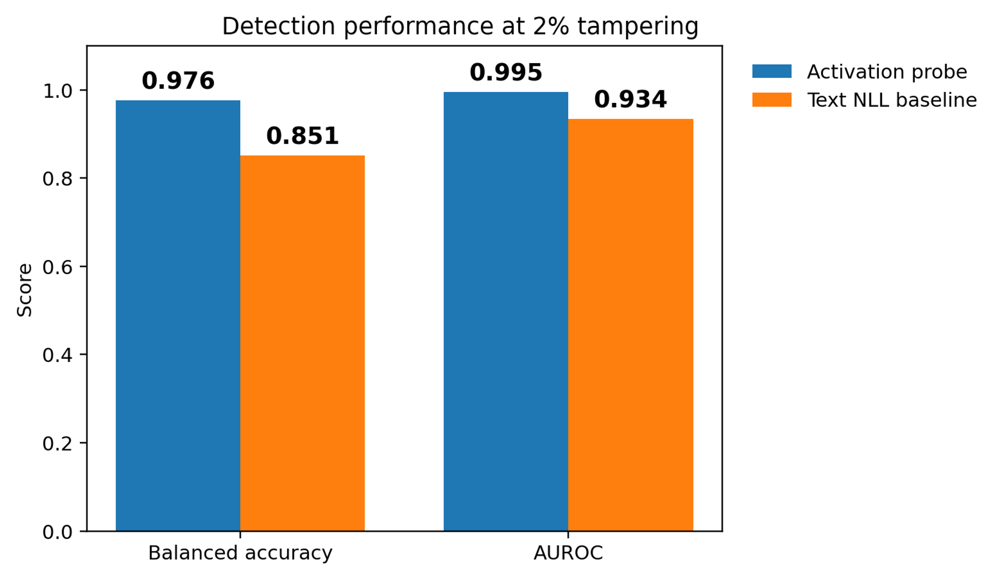
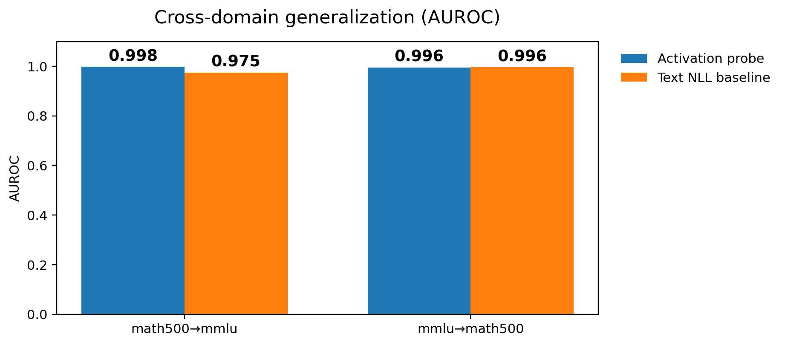

# Detecting Chain-of-Thought Tampering with Linear Probes

**TL;DR:** We test whether simple linear detectors can flag **tampered chain-of-thought (CoT)** in two threat models:
1) **Prefill / cache-mismatch:** the model’s *internal cached state* corresponds to a clean CoT, but the *displayed CoT tokens* are tampered before generation continues.  
2) **Post-hoc / displayed-trace tamper:** a clean CoT exists as a reference, but the user is shown an *edited* CoT after the fact.

For the full write-up and discussion, check the report here: **[Full report](https://drive.google.com/file/d/1sx5VMaUAp-xl2KF94p0wTfY2Swe5QQxF/view?usp=sharing)**

---

## Motivation

Recent discussion suggests that current LLMs **rarely self-report** when their visible CoT has been tampered (even if the tamper is obvious).  
This repo asks: *even if the model doesn’t self-report, can we still detect tampering with simple signals like activations, NLL, or similarity statistics?*

---

## Experimental setup

**Data:** 60 MATH500 + 60 MMLU (120 problems total)  
**Model:** `deepseek-ai/DeepSeek-R1-Distill-Qwen-32B`  
**Tamper ops:** `token_delete`, `token_insert`, `sentence_remove`, `sentence_paraphrase`  
**Splitting:** CoT is split in half; we tamper the first half (prefill surface).  
**Detectors:**
- **Text NLL baseline:** conditional NLL of the displayed trace
- **Activation probe (prefill):** logistic regression on concatenated last-token hidden states from layers `[-1, -4, -8, -16, -32]`
- **Post-hoc similarity probe:** logistic regression on reference-vs-displayed similarity scalars

**Metrics:** AUROC, balanced accuracy  
**Splits:** `GroupShuffleSplit` by problem (base UID), to avoid leakage.

---

## Key results

### Prefill threat model: activations are a strong tamper signal
<p align="left">
  
</p>

- Activation probe strongly outperforms the NLL baseline on overall detection.
<p align="left">
  
</p>
- Probe generalizes cross domain (math500 dataset to mmlu and vice-versa)

### Post-hoc threat model: similarity features are strongest (when a clean reference exists)
<p align="left">
  
</p>

- Reference-based similarity features can beat both text-only NLL and activation-vector probes in this setting.
- Limitation: requires an available **clean reference trace**.

> Note: Self-report rates are reported in the PDF; they’re rare even under obvious corruptions.

---

## Repo layout

- `cot_integrity/` – core library (tampering, prompting, feature extraction, probing helpers)
- `scripts/` – runnable experiment + plotting scripts
- `imgs/` – demo figures used in this README
- `runs/` – **local outputs only** (ignored by git)

---

## Installation

### 1) Create env
```bash
python -m venv .venv
source .venv/bin/activate
pip install -U pip
```

### 2) Install dependencies
```bash
pip install -r requirements.txt
```

### 3) Install dependencies
```bash
pip install -e .
```

### Running the experiments
> These scripts are designed for research runs; DeepSeek-R1-Distill-Qwen-32B is large and typically requires a multi-GPU setup.

### A) Prefill experiment (cache-mismatch threat model)
```bash
python scripts/run_prefill_experiment.py \
  --model deepseek-ai/DeepSeek-R1-Distill-Qwen-32B \
  --out_dir runs/prefill_tp2 \
  --n_math 60 --n_mmlu 60 \
  --tamper_types token_delete token_insert sentence_remove sentence_paraphrase \
  --tamper_pcts 2 \
  --token_insert_mode in_distribution \
  --layers -1 -4 -8 -16 -32
```
---

This writes (among others):
- `metrics_prefill.json`
- `features_prefill.csv`
- `X_act_prefill_fp16.npy`
- `layer_slices.json`
- `train_idx.npy`, `test_idx.npy`

---
### B) Prefill generalization evaluation
```bash
python scripts/eval_generalization_prefill.py --run_dir runs/prefill_tp2
python scripts/plot_generalization_prefill.py --run_dir runs/prefill_tp2
```

### C) Post-hoc experiment (displayed-trace tamper)
```bash
python scripts/run_posthoc_experiment.py \
  --model deepseek-ai/DeepSeek-R1-Distill-Qwen-32B \
  --out_dir runs/posthoc_tp2 \
  --prefill_out_dir runs/prefill_tp2 \
  --n_math 60 --n_mmlu 60 \
  --tamper_types token_delete token_insert sentence_remove sentence_paraphrase \
  --tamper_pcts 2 \
  --layers -1 -4 -8 -16 -32
```

### D) Plot overall figures
```bash
python scripts/plot_overall_metrics.py --run_dir runs/prefill_tp2
python scripts/plot_posthoc.py --run_dir runs/posthoc_tp2
```